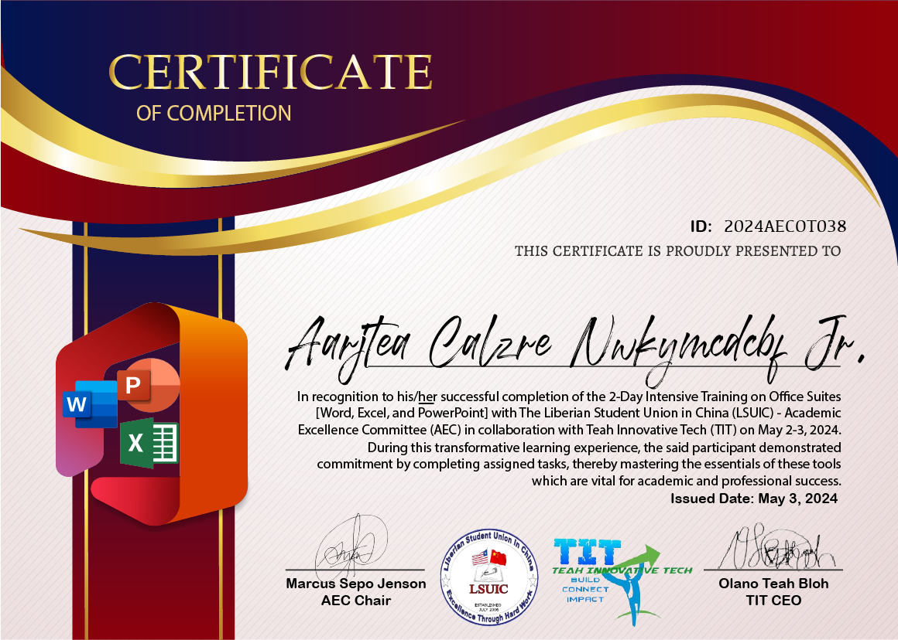

# Certificate Generator

This Python script automates the generation of certificates for participants based on the data provided in a CSV file. Each certificate contains the participant's name, ID, and sex, and is saved as a PNG file in the `results` directory.

## Prerequisites

- Python 3.x
- Required Python packages listed in `requirements.txt`

## Setup

1. Clone or download this repository to your local machine.
2. Install the required Python packages using pip:

```bash
pip install -r requirements.txt
```
3. Place your font files (`.ttf` or `.otf`) in the `font` directory. Make sure the font files are named correctly in the code.

## Usage
1. Prepare your data:
- Create a CSV file named `participants.csv` in the `data` directory.
- The CSV file should contain three columns: `Name`, `ID`, and `Sex`.
- Example:
```bash
Name,ID,Sex
John Doe,001,Male
Jane Smith,002,Female
Michael Johnson,003,Male
Emily Brown,004,Female
```
2. Run the script:

```bash
python main.py
```
3. The script will generate certificates for each participant and save them in the `results` directory.

## Font Requirements

- The script uses custom fonts for the certificate generation.
- Make sure to place the font files (`.ttf` or `.otf`) in the `font` directory.
- Update the font paths in the code if using different font files.

## Additional Notes

- The script calculates the name count (including spaces) for each participant's name and sorts the certificates based on the name count.
- If any fonts are not found, the script will print an error message and will not generate the certificates.
- The script uses the `PIL` library to create the certificates.
- Coordinates for name, ID, and sex fields (`name_x`,`name_y`, `id_x`, `id_y`, `sex_x`,` sex_y`) can be adjusted based on the background image template structure. 
- If using a new background image with different dimensions, users need to adjust the alignment in the code. For adjusting alignment based on a new background image, users can refer to online tools like [Image Map](https://www.image-map.net/) or other tools to determine the correct coordinates for their template structure.

## Background Image

The background image for the certificates should have the following specifications:
- Width: 1160 pixels
- Height: 828 pixels
- Format: PNG
- Color Mode: RGBA

## Generated Certificate
Default certificate template: sample


Below is an example of a generated certificate:



## Inspiration
This project was inspired by the need to automate certificate generation tasks, which can be time-consuming when done or design manually. The script provides an efficient solution, allowing designers, developers or users to focus on more important tasks.